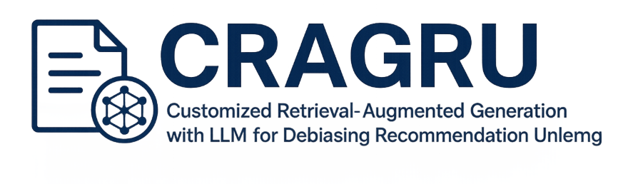
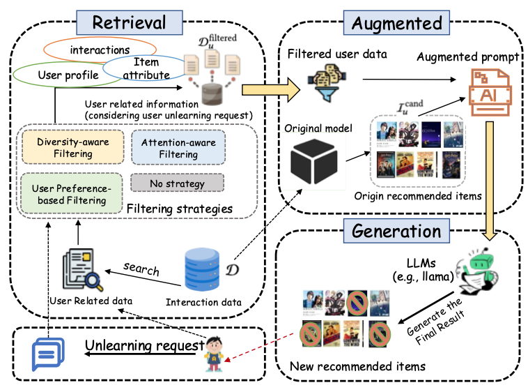

<!-- markdownlint-disable first-line-h1 -->
<!-- markdownlint-disable html -->
<!-- markdownlint-disable no-duplicate-header -->


<div align="center">
  
</div>

<hr>


[](https://pypi.org/project/recbole/)
[](https://anaconda.org/aibox/recbole)
[](./LICENSE)
[](https://arxiv.org/abs/2511.05494)

<p align="center">
<strong><big>If you find our work useful, please consider giving us a star🌟</big></strong>
</p>


## :memo: TODO

- [x] Code Release
- [x] Paper Release
- [x] Datasets

## 📋 Table of Contents

- [Customized Retrieval-Augmented Generation with LLM for Debiasing Recommendation Unlearning](#Customized Retrieval-Augmented Generation with LLM for Debiasing Recommendation Unlearning)
  - [🔎 Overview](#overview)
  - [🛠️ Installation](#installation)
  - [🚀 Quick Start](#-quick-start)
  - [⚙️ Citation](#citation)


## Overview

**CRAGRU** is a unified framework that integrates **RAG (Retrieval-Augmented Generation)**, **Large Language Models (LLMs)**, and **Recommendation Unlearning**.  
It enables:

- User-level and item-level unlearning  
- Debiasing through controlled prompt design  
- LLM-based recommendation generation  
- Comparison and fusion with traditional recommender models  
- Dataset clustering, DP strategy exploration, knapsack optimization, and more

The framework is modular, reproducible, and designed for flexible experimentation.

<p align="center">

</p>
<p align="center">
<a href="">The framework of CRAGRU.</a>       
</p>


## 📦 Key Features

🔍 RAG-Enhanced LLM Recommendation
Structured prompt design ensures controlled and interpretable LLM reasoning.

🧹 Efficient Recommendation Unlearning
Supports flexible removal of user interactions or item histories.

📈 Dataset Analytics Suite
Includes clustering, statistical analysis, and knapsack-based optimization.

🧩 Modular Architecture
Every stage can be swapped or extended easily for research purposes.

## Installation
DRAGRU works with the following operating systems:

* Linux
* Windows 10
* macOS X

DRAGRU requires Python version 3.10.12 or later.

DRAGRU requires torch version 2.5.1 or later. If you want to use DRAGRU with GPU,

### Install 
```bash
pip install -r requirements.txt
```
Download [GoogleNews-vectors-negative300.bin](https://drive.google.com/file/d/0B7XkCwpI5KDYNlNUTTlSS21pQmM/edit) and put it in the library file of your python directory 

## 🚀 Quick Start

Below is the **complete DRAGRU workflow**, including **one-sentence explanations** and **directly runnable commands**.

---

### **1️⃣ Split Forget / Remain Sets**
**Description:** Splits the dataset into the *forget set* and *remain set*, which serve as the foundation for all downstream unlearning tasks.

```bash
python DRAGRU/movie-lens/dataset_split.py
```

2️⃣ Item Clustering

Description: Performs item clustering using K-means + Word2Vec to provide semantic grouping for DP strategies and prompt construction.

```bash
python DRAGRU/movie-lens/statistics/item_cluster.py
```

3️⃣ Construct LLM Prompts

Description: Creates prompt files based on the remain set, serving as structured input for LLM-based recommendation.

```bash
python DRAGRU/movie-lens/data_preprocess_unlearning.py
```

4️⃣ Run LLM Recommendation

Description: Generates recommendation results using a large language model, with optional fallback to traditional models.

```bash
python DRAGRU/movie-lens/llm_recommender.py --input prompt_file.json
```

5️⃣ Evaluate Results

Description: Computes evaluation metrics using the recommendation results from the previous step.

```bash
python DRAGRU/movie-lens/evaluation.py --input recommender_output.json
```

## 🤝 Contributing

Contributions, suggestions, and pull requests are welcome.
Feel free to ask for improvements (README, visualization, scripts, etc.).

## ⭐ If You Find This Useful

Please consider ⭐ starring the repository — it's the best way to support this project.

## Citation

```bibtex
@article{zhang2025customized,
  title={Customized Retrieval-Augmented Generation with LLM for Debiasing Recommendation Unlearning},
  author={Zhang, Haichao and Zhang, Chong and Hu, Peiyu and Qiu, Shi and Wang, Jia},
  journal={arXiv preprint arXiv:2511.05494},
  year={2025}
}